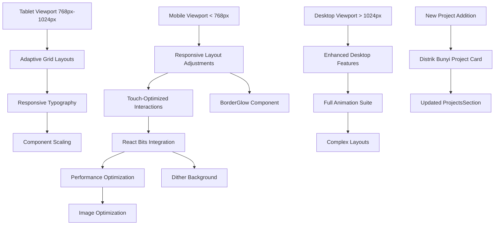

# Design Document: Mobile-Responsive Portfolio UI

## Overview

This design document outlines the implementation of mobile-responsive enhancements for the existing Next.js portfolio website. The primary goals are to:
1. Optimize the current layout for mobile devices (smartphones)
2. Integrate React Bits UI components (BorderGlow and Dither) for enhanced visual effects
3. Add a new "Distrik Bunyi" project to the portfolio with the specified description
4. Ensure seamless responsive behavior across all screen sizes while maintaining the existing aesthetic

The portfolio currently uses a modern dark theme with glass-morphism effects, particle backgrounds, and interactive components. The mobile-responsive implementation will focus on adaptive layouts, touch-friendly interactions, and performance optimization for mobile devices.

## Architecture

The responsive design will follow a mobile-first approach with progressive enhancement for larger screens. The architecture will maintain the existing component structure while adding responsive breakpoints and mobile-specific optimizations.



## Components and Interfaces

### Component 1: ResponsiveLayoutWrapper

**Purpose**: A wrapper component that provides responsive context and manages layout adjustments based on viewport size.

**Interface**:
```typescript
interface ResponsiveLayoutProps {
  children: React.ReactNode;
  breakpoints?: {
    mobile: number;
    tablet: number;
    desktop: number;
  };
  enableTouchOptimization?: boolean;
}

interface ResponsiveContextType {
  isMobile: boolean;
  isTablet: boolean;
  isDesktop: boolean;
  viewportWidth: number;
  viewportHeight: number;
}
```

**Responsibilities**:
- Detect viewport size changes
- Provide responsive context to child components
- Manage touch vs mouse interaction modes
- Handle orientation changes on mobile devices

### Component 2: MobileOptimizedProjectsSection

**Purpose**: Enhanced version of ProjectsSection with mobile-optimized layout and BorderGlow integration.

**Interface**:
```typescript
interface MobileOptimizedProjectsSectionProps {
  projects: Array<{
    title: string;
    description: string;
    tags: string[];
    color: string;
    link: string;
    image: string;
  }>;
  enableBorderGlow?: boolean;
  glowIntensity?: 'low' | 'medium' | 'high';
  mobileLayout?: 'grid' | 'carousel' | 'stack';
}

interface ProjectCardProps {
  project: ProjectType;
  index: number;
  isMobile: boolean;
  enableGlow: boolean;
}
```

**Responsibilities**:
- Render projects in mobile-optimized layout (grid/carousel/stack)
- Integrate BorderGlow component for featured project borders
- Handle touch interactions for mobile devices
- Provide smooth transitions between layout modes

### Component 3: DitherBackground

**Purpose**: Enhanced background component integrating React Bits Dither effect.

**Interface**:
```typescript
interface DitherBackgroundProps {
  intensity?: number;
  pattern?: 'noise' | 'halftone' | 'checkerboard';
  color?: string;
  opacity?: number;
  blendMode?: 'normal' | 'multiply' | 'screen' | 'overlay';
  responsive?: boolean;
  mobileIntensity?: number;
}
```

**Responsibilities**:
- Apply dithering effect to background
- Adjust intensity based on device capabilities
- Optimize performance for mobile devices
- Provide smooth transitions between patterns

## Data Models

### Model 1: Project Data Structure

```typescript
interface Project {
  id: string;
  title: string;
  description: string;
  detailedDescription?: string; // For expanded view on mobile
  tags: string[];
  color: string;
  link: string;
  image: string;
  featured?: boolean; // For BorderGlow application
  mobileImage?: string; // Optimized image for mobile
  technologies: string[];
  status?: 'active' | 'completed' | 'archived';
  dateAdded: Date;
}

// New Distrik Bunyi project
const distrikBunyiProject: Project = {
  id: 'distrik-bunyi-2026',
  title: 'Distrik Bunyi',
  description: 'An Indonesian indie music media platform featuring KURATOR AI, an AI music discovery chatbot powered by Gemini API.',
  detailedDescription: 'Built with Next.js, Tailwind CSS & Supabase. Submitted to JuaraVibeCoding 2026 by Google, deployed on Google Cloud Run. Features include AI-powered music recommendations, curated playlists, and artist discovery.',
  tags: ['Next.js', 'Tailwind CSS', 'Supabase', 'Gemini API', 'Google Cloud Run', 'AI Chatbot'],
  color: '#14b8a6', // Teal
  link: 'https://distrik-bunyi-697721761061.asia-southeast2.run.app/',
  image: 'https://images.unsplash.com/photo-1511671782779-c97d3d27a1d4?auto=format&fit=crop&q=80&w=800',
  featured: true, // Will have BorderGlow effect
  technologies: ['Next.js 14', 'TypeScript', 'Tailwind CSS', 'Supabase', 'Gemini API', 'Google Cloud Run'],
  status: 'active',
  dateAdded: new Date('2024-01-01')
};
```

### Model 2: Responsive Configuration

```typescript
interface ResponsiveConfig {
  breakpoints: {
    mobile: number; // Default: 768px
    tablet: number; // Default: 1024px
    desktop: number; // Default: 1280px
  };
  touchOptimization: {
    minTouchTarget: number; // Minimum 44px for iOS guidelines
    hoverToTapDelay: number; // Delay before tap action
    swipeThreshold: number; // Distance for swipe detection
  };
  performance: {
    lazyLoadImages: boolean;
    reduceMotion: boolean; // Respect prefers-reduced-motion
    optimizeAnimations: boolean; // Simplify animations on mobile
  };
}
```

## Algorithmic Pseudocode

### Main Responsive Layout Algorithm

```pascal
ALGORITHM applyResponsiveLayout(currentViewport, contentElements)
INPUT: currentViewport (width, height, orientation), contentElements (array of DOM elements)
OUTPUT: optimizedLayout (adjusted element positions and sizes)

BEGIN
  // Step 1: Determine device category
  deviceCategory ← classifyDevice(currentViewport.width)
  
  // Step 2: Apply base responsive rules
  FOR each element IN contentElements DO
    CASE deviceCategory OF
      'mobile': 
        element.layout ← mobileLayoutRules(element)
        element.interaction ← touchOptimizedInteractions(element)
        element.animations ← simplifiedAnimations(element)
      
      'tablet':
        element.layout ← tabletLayoutRules(element)
        element.interaction ← hybridInteractions(element)
        element.animations ← optimizedAnimations(element)
      
      'desktop':
        element.layout ← desktopLayoutRules(element)
        element.interaction ← mouseOptimizedInteractions(element)
        element.animations ← fullAnimations(element)
    END CASE
  END FOR
  
  // Step 3: Apply React Bits integrations
  IF deviceCategory ≠ 'mobile' OR performanceMode = false THEN
    applyBorderGlowToFeaturedProjects(contentElements)
    applyDitherBackground(contentElements.background)
  END IF
  
  // Step 4: Performance optimization
  IF deviceCategory = 'mobile' THEN
    optimizeImagesForMobile(contentElements.images)
    deferNonCriticalAnimations(contentElements.animations)
    enableTouchGestures(contentElements.interactive)
  END IF
  
  RETURN optimizedLayout
END
```

**Preconditions**:
- currentViewport contains valid width and height values
- contentElements is a non-empty array of DOM elements
- CSS viewport meta tag is properly configured

**Postconditions**:
- All elements have appropriate responsive styling applied
- Interactive elements are optimized for the current device type
- Performance optimizations are applied for mobile devices
- React Bits components are integrated where appropriate

**Loop Invariants**:
- Each element maintains its semantic meaning throughout layout adjustments
- Accessibility attributes are preserved during transformations
- Element z-index hierarchy remains consistent

### Mobile Touch Interaction Algorithm

```pascal
ALGORITHM handleTouchInteractions(touchEvent, targetElement)
INPUT: touchEvent (TouchEvent object), targetElement (DOM element)
OUTPUT: interactionResult (processed action)

BEGIN
  // Step 1: Determine interaction type
  IF touchEvent.touches.length = 1 THEN
    interactionType ← 'tap'
    processTapInteraction(touchEvent, targetElement)
  ELSE IF touchEvent.touches.length = 2 THEN
    interactionType ← 'pinch'
    processPinchInteraction(touchEvent, targetElement)
  END IF
  
  // Step 2: Apply touch feedback
  IF targetElement.hasAttribute('data-touch-feedback') THEN
    showTouchFeedback(targetElement, touchEvent)
  END IF
  
  // Step 3: Prevent accidental interactions
  IF touchEvent.timeStamp - lastInteractionTime < MIN_INTERACTION_INTERVAL THEN
    RETURN 'interaction_throttled'
  END IF
  
  // Step 4: Execute action
  actionResult ← executeElementAction(targetElement, interactionType)
  
  // Step 5: Update interaction history
  lastInteractionTime ← touchEvent.timeStamp
  
  RETURN actionResult
END
```

**Preconditions**:
- touchEvent is a valid TouchEvent
- targetElement is a DOM element that can receive touch events
- Touch event listeners are properly attached

**Postconditions**:
- Appropriate visual feedback is provided for touch interactions
- Accidental rapid taps are prevented
- Element actions are executed with proper timing
- Interaction history is updated for future event handling

**Loop Invariants**:
- Touch event coordinates remain within viewport bounds
- Element state transitions are atomic and consistent
- Accessibility focus is maintained during interactions

## Key Functions with Formal Specifications

### Function 1: integrateBorderGlow()

```typescript
function integrateBorderGlow(
  element: HTMLElement, 
  options: BorderGlowOptions
): BorderGlowInstance
```

**Preconditions**:
- `element` is a valid DOM element with defined dimensions
- `options.intensity` is between 0 and 1
- `options.color` is a valid CSS color string
- React Bits library is available in the global scope

**Postconditions**:
- Returns a BorderGlowInstance with cleanup method
- Element has BorderGlow effect applied to its borders
- Effect intensity matches specified options
- Performance impact is minimized for mobile devices

**Loop Invariants**: N/A (no loops in this function)

### Function 2: applyDitherEffect()

```typescript
function applyDitherEffect(
  container: HTMLElement,
  config: DitherConfig
): DitherController
```

**Preconditions**:
- `container` has non-zero width and height
- `config.pattern` is one of: 'noise', 'halftone', 'checkerboard'
- `config.opacity` is between 0 and 1
- Container has proper positioning context

**Postconditions**:
- Returns DitherController with update and destroy methods
- Dither effect is applied to container background
- Effect respects mobile performance constraints
- Effect can be dynamically updated based on viewport

**Loop Invariants**: N/A (no loops in this function)

### Function 3: optimizeForMobile()

```typescript
function optimizeForMobile(
  component: React.Component,
  config: MobileOptimizationConfig
): OptimizedComponent
```

**Preconditions**:
- `component` is a valid React component
- `config.viewport` contains current viewport dimensions
- `config.performanceMode` is a boolean flag
- Component supports responsive props

**Postconditions**:
- Returns component with mobile-optimized props
- Images are lazy-loaded if configured
- Animations are simplified for mobile if needed
- Touch interactions are properly configured

**Loop Invariants**: 
- Component functionality remains unchanged
- Accessibility features are preserved
- Visual hierarchy is maintained

## Example Usage

```typescript
// Example 1: Mobile-optimized ProjectsSection with BorderGlow
const MobileProjects = () => {
  const { isMobile, viewportWidth } = useResponsiveContext();
  
  return (
    <MobileOptimizedProjectsSection
      projects={projectsWithDistrikBunyi}
      enableBorderGlow={!isMobile || viewportWidth > 480}
      glowIntensity={isMobile ? 'low' : 'medium'}
      mobileLayout={isMobile ? 'stack' : 'grid'}
    />
  );
};

// Example 2: Responsive background with Dither
const ResponsiveBackground = () => {
  const { isMobile } = useResponsiveContext();
  
  return (
    <DitherBackground
      intensity={0.3}
      pattern="noise"
      color="rgba(99,102,241,0.1)"
      opacity={isMobile ? 0.2 : 0.3}
      blendMode="overlay"
      responsive={true}
      mobileIntensity={0.15}
    />
  );
};

// Example 3: Complete mobile-responsive page
const MobileResponsivePage = () => {
  return (
    <ResponsiveLayoutWrapper
      breakpoints={{ mobile: 768, tablet: 1024, desktop: 1280 }}
      enableTouchOptimization={true}
    >
      <DitherBackground />
      
      <main style={{ position: 'relative', zIndex: 1 }}>
        {/* Hero section with mobile-optimized layout */}
        <section id="home" style={mobileHeroStyles}>
          <h1>Gabriel Adetya Utomo</h1>
          {/* ... other hero content */}
        </section>
        
        {/* Projects section with BorderGlow */}
        <section id="projects">
          <MobileProjects />
        </section>
        
        {/* Other sections with responsive adjustments */}
      </main>
    </ResponsiveLayoutWrapper>
  );
};
```

## Correctness Properties

1. **Responsive Consistency Property**: For all viewport widths w, the layout L(w) must maintain visual hierarchy and content readability. Formally: ∀w₁, w₂ ∈ ViewportWidth, readability(L(w₁)) = readability(L(w₂)).

2. **Touch Target Accessibility Property**: All interactive elements on mobile devices must have minimum touch target size of 44×44 pixels. Formally: ∀e ∈ InteractiveElements, isMobile ⇒ width(e) ≥ 44 ∧ height(e) ≥ 44.

3. **Performance Boundary Property**: On mobile devices, animation frame rate must not drop below 30fps. Formally: isMobile ⇒ fps(animations) ≥ 30.

4. **BorderGlow Integration Property**: BorderGlow effect must only be applied to featured projects and must not affect touch interactions. Formally: ∀p ∈ Projects, hasBorderGlow(p) ⇒ isFeatured(p) ∧ ¬interferesWithTouch(p).

5. **Dither Performance Property**: Dither effect intensity must be reduced on mobile devices to maintain performance. Formally: isMobile ⇒ intensity(dither) ≤ 0.2.

## Error Handling

### Error Scenario 1: React Bits Library Not Available

**Condition**: When React Bits components (BorderGlow, Dither) are not loaded
**Response**: Fall back to CSS-based alternatives with similar visual effects
**Recovery**: Log warning to console and use degraded visual experience

### Error Scenario 2: Mobile Performance Degradation

**Condition**: When animation performance drops below acceptable threshold on mobile
**Response**: Automatically reduce animation complexity and disable non-essential effects
**Recovery**: Provide user option to toggle performance mode in settings

### Error Scenario 3: Touch Interaction Conflicts

**Condition**: When touch gestures conflict with scroll behavior
**Response**: Implement gesture conflict resolution with priority to scroll
**Recovery**: Provide visual feedback when touch action is intercepted

## Testing Strategy

### Unit Testing Approach

- Test responsive breakpoint detection logic
- Verify BorderGlow component integration
- Validate Dither effect application
- Test mobile touch interaction handlers
- Verify project data structure updates

**Key Test Cases**:
1. ProjectsSection renders correctly on mobile viewport
2. BorderGlow effect is applied only to featured projects
3. Dither background adjusts intensity based on device
4. Touch targets meet minimum size requirements
5. New Distrik Bunyi project is properly added

### Property-Based Testing Approach

**Property Test Library**: fast-check

**Properties to Test**:
1. Responsive layout maintains content hierarchy across all viewport sizes
2. Touch interactions are always accessible on mobile devices
3. Performance metrics stay within acceptable bounds
4. Visual effects degrade gracefully on low-performance devices

### Integration Testing Approach

- Test complete mobile-responsive page rendering
- Verify cross-browser compatibility on mobile devices
- Test real device interactions (touch, swipe, pinch)
- Validate performance metrics on actual mobile hardware

## Performance Considerations

### Mobile Optimization Strategies

1. **Image Optimization**: Serve WebP images with responsive srcset attributes
2. **Animation Throttling**: Reduce animation complexity on mobile devices
3. **Lazy Loading**: Defer non-critical component loading
4. **CSS Containment**: Use CSS containment for complex components
5. **Font Loading**: Optimize font loading with font-display: swap

### Performance Budget

- First Contentful Paint (FCP): < 1.5s on mobile 3G
- Largest Contentful Paint (LCP): < 2.5s
- Cumulative Layout Shift (CLS): < 0.1
- First Input Delay (FID): < 100ms

## Security Considerations

1. **External Resource Loading**: Validate all external image URLs before loading
2. **User Input Sanitization**: Sanitize any user-generated content in project descriptions
3. **Link Security**: Ensure all external links use rel="noopener noreferrer"
4. **Dependency Security**: Keep React Bits and other dependencies updated

## Dependencies

### Required Dependencies
- React Bits library (for BorderGlow and Dither components)
- Next.js Image component (for responsive image optimization)
- CSS custom properties (for theme consistency)

### Optional Dependencies
- react-responsive (for enhanced responsive utilities)
- framer-motion (for optimized animations on mobile)
- react-touch (for advanced touch gesture handling)

### Development Dependencies
- Jest with React Testing Library
- Cypress for mobile integration testing
- Lighthouse CI for performance monitoring